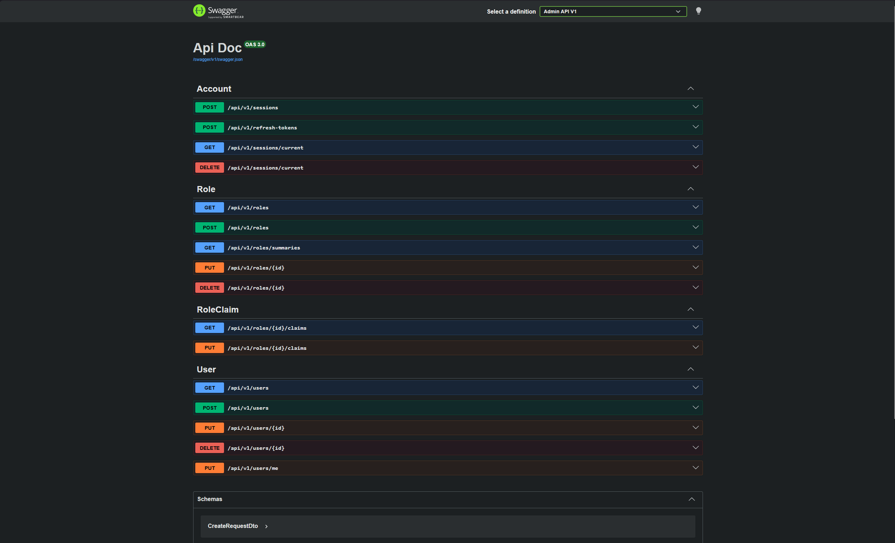
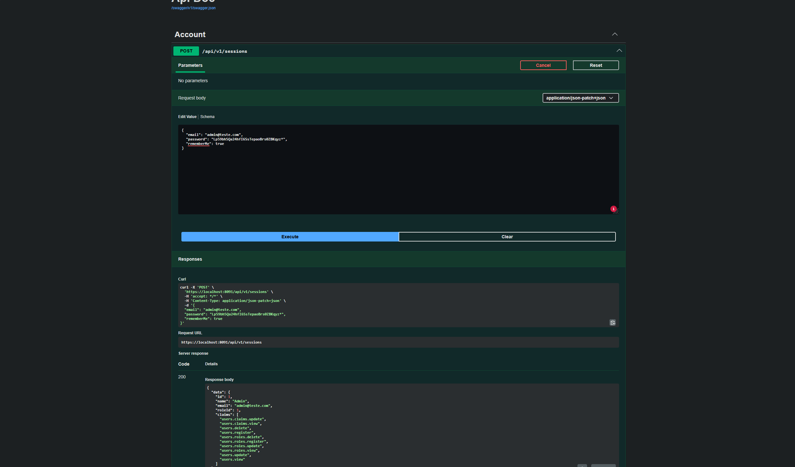

# API base multi tenant .net 9.0

API em ASP.NET Core com foco em autenticação, multi tenant simples, **ASP.NET Identity**, **cookie auth** e **refresh token**.

A ideia do projeto é manter tudo simples, organizado e com um padrão bem definido, para servir como base para futuros projetos que precisam ter mais de uma aplicação usando o mesmo banco e o mesmo núcleo:

- **DTOs com `record`** para entrada e saída
- **Response padrão** para quase todas as respostas da API
- **PagedResponse** para consultas paginadas
- **Validação** na controller
- **Services** focados em regra de negócio
- **Identity customizado** com entidades próprias e `long` como chave
- **Mappings do Identity** separados para controlar tamanho de campos, nomes de tabela e afins
- **Api.Core** com o que é compartilhado entre as APIs, como contexto, entidades, mappings e migrations
- **Api** para a parte admin/recrutador
- **Api.Client** para a parte cliente
- **ConfigApp** centralizando parâmetros estáticos da aplicação
- **ExceptionMiddleware** para capturar erro inesperado e devolver no padrão da API

## Multi tenant

O objetivo do multi tenant aqui é ser básico e bem feito, sem tentar resolver tudo antes da hora.

A ideia é ter um único banco para vários clientes/empresas, separando os acessos pelo tipo de usuário e pela empresa vinculada.

Hoje a base já tem:

- `Company` representando a empresa/tenant
- `AdminUser` vinculado a um usuário e uma empresa
- `ClientUser` vinculado a um usuário e uma empresa
- `UserType` no usuário para separar `Admin` e `Client`
- claims com referências importantes, como `user_type`, `company_id` e `tenant_id`

O `Api` aceita somente usuário admin.
O `Api.Client` aceita somente usuário cliente.

Os dois usam o mesmo `Api.Core`, o mesmo `ApplicationDbContext` e o mesmo banco.

Ainda não é um multi tenant cheio de abstração e filtro global em todas as entidades. A ideia é evoluir isso conforme as entidades de negócio forem entrando, sempre filtrando pelo tenant/empresa quando fizer sentido.

## Autenticação

A autenticação usa **cookie do Identity** como login principal.
Além disso, existe um **refresh token** salvo no banco e enviado por cookie `HttpOnly`.

Fluxo:

1. Usuário faz login
2. API cria o cookie de autenticação
3. API gera e salva refresh token
4. Quando precisar renovar a sessão, usa o refresh token
5. No logout, encerra sessão e revoga o refresh token

## Padrão de retorno

A API trabalha com um objeto `Response<T>` simples:

- `data`
- `message`

Para paginação, usa `PagedResponse<T>` com:

- `data`
- `message`
- `currentPage`
- `pageSize`
- `totalCount`
- `totalPages`

Mantenha sempre esse padrão! E envolva as respostas da API com ele.

## Seed inicial

Se você iniciar o `Api` como Staging, ele irá gerar as migrations e popular os dados iniciais.
A seed fica somente no `Api`, não no `Api.Client`.

Hoje a seed cria uma empresa base, usuário admin, usuário cliente, roles e permissões do admin.

Usuário admin:

- nome: `Admin`
- email: `admin@teste.com`
- Vai encontrar a senha do Admin senha dentro de `Configurations/Seed/AdminUserSeed`

Usuário cliente:

- nome: `Client`
- email: `client@teste.com`
- Vai encontrar a senha do cliente dentro de `Configurations/Seed/ClientUserSeed`

Lembre-se de trocar usuário/senha em produção.

### Api.UnitTests (xUnit)

O teste está bem simples, só para garantir a validação dos requests das controllers (Input Model Validation), conforme as regras forem definidas
Seria interessante criar teste nos principais métodos de serviços.

Rodar testes:
**dotnet test**

## Observações

o objetivo é ser simples e pratico:

- controller simples
- service com regra de negócio
- configurações centralizada
- retorno padronizado
- núcleo compartilhado no `Api.Core`
- coisas especificas ficam em cada API
- multi tenant basico antes de qualquer complexidade

## Banco

O projeto não deve depender de banco local para rodar.

As duas APIs usam a connection string via **user-secrets**, apontando para o banco de homologação.

Projetos que precisam estar com secret configurado:

- `Api`
- `Api.Client`

Chave usada:

- `ConnectionStrings:DefaultConnection`

Se aparecer erro tentando conectar em `localhost:5432`, provavelmente a API foi iniciada sem carregar os secrets ou está em um ambiente errado.
